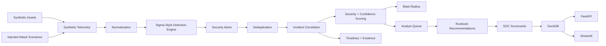
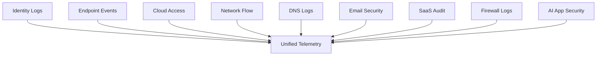
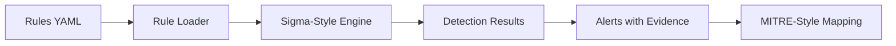
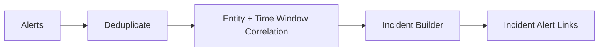
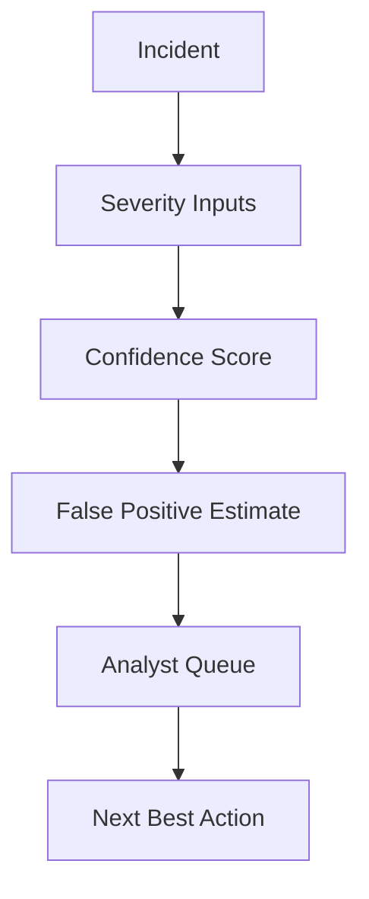
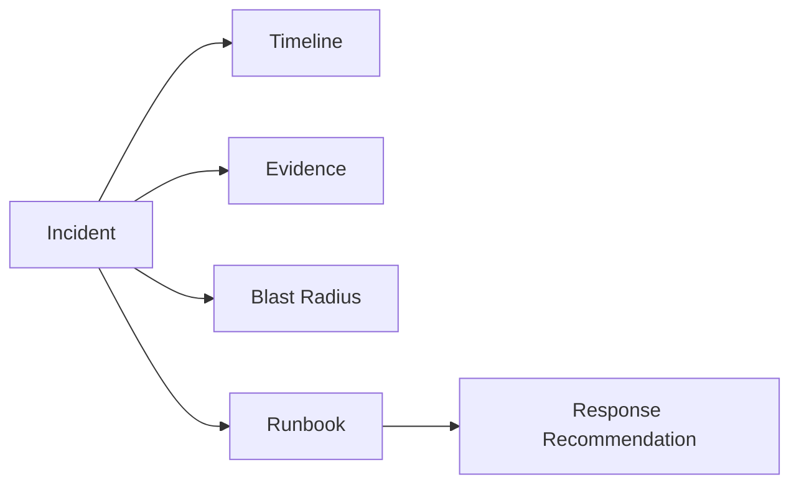

# AI SOC Telemetry Triage Platform

## Executive Summary

This project simulates a modern Security Operations Center data platform.

A basic security dashboard asks: **"What alerts fired?"**

This project asks: **"Which alerts belong together, how severe is the incident, what evidence supports it, what is the likely attacker behavior, what systems are impacted, and what should the analyst do next?"**

Security teams receive telemetry from identity systems, endpoints, cloud logs, SaaS apps, email gateways, DNS, firewalls, and AI applications. The challenge is not simply collecting alerts. The challenge is correlating them into meaningful incidents, reducing noise, prioritizing risk, and giving analysts explainable evidence.

This platform generates synthetic SOC telemetry, injects attack scenarios, applies Sigma-style detection rules, maps detections to MITRE-style tactics, correlates alerts into incidents, generates analyst queues, estimates blast radius, and produces SOC scorecards.

**Positioning:** I build AI-assisted SOC data platforms that turn fragmented security telemetry into correlated incidents, analyst-ready investigations, and measurable detection quality.

## Business Problem

Modern SOC teams face alert overload:

- too many low-quality alerts
- duplicate alerts from multiple systems
- identity alerts not linked to endpoint activity
- cloud access anomalies not linked to data movement
- suspicious email activity not linked to authentication events
- AI prompt-injection attempts not connected to data access
- analysts spending time on false positives
- missing blast-radius context
- weak incident timelines
- inconsistent runbooks

The business risk is missed attacks, delayed response, analyst fatigue, and poor visibility into SOC effectiveness.

## Why This Is Not a Basic Security Dashboard

This repo does not only show alert counts. It builds a deterministic SOC triage pipeline: synthetic telemetry generation, attack injection, detection-as-code, MITRE-style mapping, deduplication, incident correlation, severity/confidence scoring, blast-radius analysis, analyst queues, timelines, runbooks, scorecards, API, dashboard, Docker, and CI.

## Architecture



## Telemetry Flow



## Detection Flow



## Correlation Flow



## Triage Flow



## Incident Response Flow



## Attack Scenario Catalog

The platform injects 20 controlled scenarios: impossible travel, password spray, brute force against privileged user, MFA fatigue, cloud privilege escalation, suspicious service account access, data exfiltration, OAuth consent abuse, phishing click, endpoint malware, ransomware precursor, DNS beaconing, AI prompt injection, AI sensitive data request, insider data access, cloud key exposure, lateral movement, C2 pattern, mass public file sharing, and dormant account reactivation.

## Detection Rule Examples

Rules live under `rules/` by source domain. Each rule includes rule ID, title, log source, detection logic, severity, tactic, technique, false-positive notes, and recommended response. The local rule engine is Sigma-style, not an official Sigma integration.

## MITRE-Style Mapping

Detections map to MITRE-style tactics and techniques such as Initial Access, Credential Access, Privilege Escalation, Defense Evasion, Discovery, Lateral Movement, Command and Control, Exfiltration, and Impact. These mappings are synthetic and local for portfolio demonstration.

## Analyst Workflow

1. Review `/soc-summary` or the dashboard Executive Overview.
2. Open the analyst queue.
3. Inspect correlated incident evidence and timeline.
4. Review blast-radius report.
5. Use the recommended runbook.
6. Mark known false positives or escalate high-severity incidents.

## Scorecards

- `detection_quality_report.json/csv`
- `incident_triage_report.json/csv`
- `mitre_coverage_report.json/csv`
- `soc_performance_report.json/csv`
- `false_positive_report.json/csv`
- `response_readiness_report.json/csv`
- `attack_scenario_detection_report.json/csv`

## Quickstart

```bash
python -m venv .venv
source .venv/bin/activate
python -m pip install --upgrade pip
python -m pip install -r requirements.txt

python -m src.data_generation.generate_assets
python -m src.data_generation.generate_telemetry
python -m src.data_generation.inject_attack_scenarios
python -m src.data_generation.generate_ground_truth
python -m src.pipeline.run_all
python -m pytest
python -m ruff check .
```

## API

```bash
uvicorn src.api.main:app --reload
```

Endpoints include `/health`, `/soc-summary`, `/telemetry-sources`, `/alerts`, `/alerts/{alert_id}`, `/incidents`, `/incidents/{incident_id}`, `/analyst-queue`, `/blast-radius/{incident_id}`, `/mitre-coverage`, `/scorecards`, `/runbooks`, `/evidence/{incident_id}`, `/simulate-attack-scenario`, `/triage-incident`, and `/mark-false-positive`.

## Dashboard

```bash
streamlit run src/dashboard/app.py
```

Dashboard sections: Executive Overview, Telemetry Sources, Detection Rules, Alerts, Correlated Incidents, Analyst Queue, MITRE-Style Coverage, Incident Timeline, Blast Radius, False Positive Review, AI App Security Events, Runbook Recommendations, and SOC Scorecards.

## Validation

V0.1 target:

- asset generation passes
- telemetry generation passes
- attack scenario injection passes
- ground truth generation passes
- full pipeline passes
- at least 70 tests pass
- ruff passes
- API and dashboard launch locally

## Known Limitations

- synthetic telemetry only
- local DuckDB instead of SIEM/data lake
- Sigma-style local rules, not official Sigma rule repository integration
- MITRE-style mapping, not official coverage validation
- deterministic rules instead of ML-based detection
- no real threat intel feeds
- no cloud deployment
- no authentication
- no real EDR/SIEM/SOAR integration

## Future Enhancements

- Sigma rule import/export
- MITRE ATT&CK Navigator layer export
- Splunk/Elastic/Sentinel connector simulation
- SOAR playbook execution
- OpenTelemetry log ingestion
- Kafka streaming telemetry
- cloud log adapters
- identity provider integration
- threat intel enrichment
- ML anomaly detection
- case management workflow
- Slack/Jira/PagerDuty escalation
- cloud deployment
- role-based access control

## Project Status

V0.1: Working baseline.

