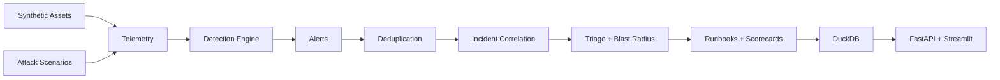

# Architecture

```mermaid
flowchart LR
    A["Synthetic Assets"] --> B["Telemetry"]
    C["Attack Scenarios"] --> B
    B --> D["Detection Engine"]
    D --> E["Alerts"]
    E --> F["Deduplication"]
    F --> G["Incident Correlation"]
    G --> H["Triage + Blast Radius"]
    H --> I["Runbooks + Scorecards"]
    I --> J["DuckDB"]
    J --> K["FastAPI + Streamlit"]
```

